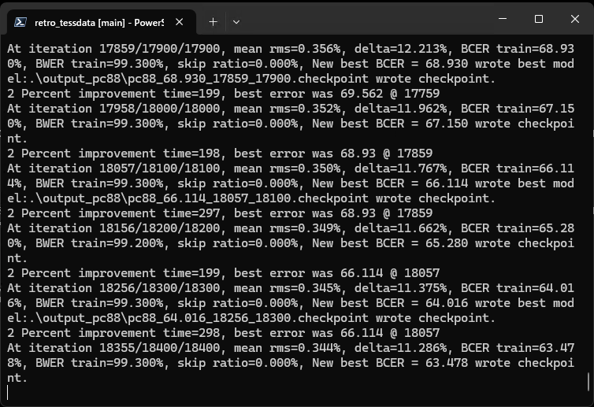

# Retro PC Font Tesseract Training Data



[日本語はこちら](README_ja.md)

This repository provides Tesseract training data created from retro PC fonts.  
Please check the `tessdata` directory. Please unzip the zip files before use.

Since this is dot-glyph training data, it is not suited for OCR of printed materials.


## Operating Procedures

### Preparation & Installation

#### Windows

- Visual Studio 2026 (C++)

- Python 3.13

Run the following in an Administrator PowerShell to remove python aliases:

```powershell
Remove-Item "$env:LOCALAPPDATA\Microsoft\WindowsApps\python.exe" -Force
Remove-Item "$env:LOCALAPPDATA\Microsoft\WindowsApps\python3.exe" -Force
```

Add `C:\Python313` to your environment variable PATH.

- vcpkg

```powershell
git clone https://github.com/microsoft/vcpkg.git
cd vcpkg
.\bootstrap-vcpkg.bat
```

- Tesseract

```powershell
.\vcpkg.exe install tesseract[training-tools]:x64-windows
```

Add `C:\vcpkg\packages\tesseract_x64-windows\tools\tesseract` to your environment variable PATH.

- Install this training environment

```powershell
git clone https://github.com/AZO234/retro_tessdata.git
cd retro_tessdata
python -m venv .venv
.venv\Scripts\Activate.ps1
pip install -r requirements.txt
```

#### Linux/macOS

- Tesseract (including training tools such as `lstmtraining`)

```bash
$ cd ~
$ sudo apt-get install tesseract-ocr tesseract-ocr-all
```

- Install this training environment

```bash
$ git clone https://github.com/AZO234/retro_tessdata.git
$ cd retro_tessdata
$ python -m venv .venv
$ source .venv/bin/activate
$ pip install -r requirements.txt
```

The only Python dependencies are `Pillow` and `numpy` (lstmf is generated directly in Python,
so text2image and the like are not needed).  
However, in addition to Tesseract itself, the training binaries `lstmtraining` /
`combine_lang_model` / `unicharset_extractor` / `merge_unicharsets` / `combine_tessdata`
must be on your PATH.


### Font ROM Placement

#### PC-8801

- `rom/pc88/KANJI1.ROM`
- `rom/pc88/KANJI2.ROM`

#### PC-9801

- `rom/pc98/FONT.ROM`

#### MSX

- `rom/msx/JAPANESE.FNT`
- `rom/msx/fs-a1gt_kanjifont.rom`

#### X68000

- `rom/x68k/CGROM.DAT`

#### FM-77 (FM-7)

- `rom/fm77/subsys_c.rom`
- `rom/fm77/kanji.rom`

#### FM-TOWNS (FMR-60/70 Compatible)

- `rom/fmt/FMT_F20.ROM`

- `rom/fmt/FMT_FNT.ROM`


### Training

#### Windows

```powershell
.venv\Scripts\activate
python main.py <architecture> full --iterate 100000
```

#### POSIX

```bash
$ source .venv/bin/activate
$ python main.py <architecture> full --iterate 100000
```

`<architecture>` is the target model name.

- PC-8801: `pc88`, `pc88_vert`, `pc88_scan`
- PC-9801: `pc98`, `pc98_vert`, `pc98_scan`
- MSX: `msx`, `msx_vert`, `msx_scan`
- X68000: `x68k`, `x68k_vert`, `x68k_scan`
- FM-77 (FM-7): `fm77`, `fm77_vert`, `fm77_scan`
- FM-TOWNS (FMR-60/70 Compatible): `fmt`, `fmt_vert`, `fmt_scan`, `f20`, `f20_vert`, `f20_scan`

`***_vert` is for vertical writing.

- Prolonged sound marks like `ー—〜… ‥` and brackets like `「」 （） 『』【】` are rotated 90 degrees clockwise.
  - Strictly speaking, vertical prolonged sound marks should have different stroke endings, but they are kept as is.
- Characters like `、 。ぁぃぅぇぉっゃゅょァィゥェォッャュョ` are shifted from bottom-left to top-right.

`***_scan` is for scanline insertion.

- Full-width characters are vertically doubled with scanlines inserted (half-width characters remain normal size). For horizontal writing only.


#### Processing Steps (`<function>`)

`full` runs the whole sequence at once. You can also run each step individually.

| function | Description |
| --- | --- |
| `clean`    | Delete generated and intermediate files |
| `generate` | Generate training images (`.tif` / `.box`) |
| `image`    | Convert the multi-page TIF to a single-page PNG (for inspection) |
| `concat`   | Generate unicharset + starter traineddata + lstmf |
| `train`    | lstmtraining + export |
| `full`     | Run the above in the order `clean → generate → image → concat → train` |

To add more training iterations only, run `python main.py <architecture> train --iterate 200000`
(it continues training from the existing checkpoint).


#### Options

| Option | Default | Description |
| --- | --- | --- |
| `--iterate N`              | 10000          | Number of training iterations (recommended for production: 100000+) |
| `--padding N`              | 1              | Cell padding (dots): the margin around each glyph. It is jittered per line to prevent over-fitting on character spacing or baseline as a separator cue |
| `--style name:weight`     | `bold:3` `normal:1` | Font style and weight. Multiple allowed. `bold` / `normal` |
| `--range RANGE`           | all            | Limit the character range, comma-separated (`ascii,kana,jis1,jis2,jis_misc,jis_ext`) |
| `--limit-chars N`         | 0              | Max number of characters per category (0 = unlimited). For trials |
| `--tight-pack` / `--no-tight-pack` | tight-pack | Trim / keep top-bottom padding (when not trimmed, net_h is fixed at 32) |
| `--corpus TOKENS`         | (none = dictionary order) | Generate training lines from a real-text corpus (see below) |
| `--max-lines N`           | 10000          | Max number of lines to generate from the corpus |
| `--finetune BASE_LANG`    | jpn            | Fine-tune from a base language (see below) |
| `--no-finetune`           | —              | Full-scratch training (takes precedence over `--finetune`) |

Run `python main.py -h` for help.


#### Styles (`--style`)

`--style bold:3` means "bold style with weight 3." Specifying `--style` multiple times mixes
them at those ratios during training. The default (when unspecified) is `bold:3` + `normal:1`
(many real game screens use a bold typeface, so bold is the primary domain).

Available styles are `bold` and `normal`.  
Note: the white-on-black (inverse) style and the noise-addition feature have been removed.
This is because the production preprocessing always normalizes to black-on-white, and
binarization erases faint smudges, so inverse-polarity and noisy data carry no meaning at
inference time.


#### Real-Text Corpus (`--corpus`)

Without this option, training lines are just characters laid out in JIS dictionary order.
With `--corpus`, you can use actual Japanese sentences as training lines (the added
language-model context tends to improve recognition accuracy on real screens). Concatenate
tokens with `+`.

| Token | Content |
| --- | --- |
| `auto`    | Aozora Bunko (literature) |
| `wiki`    | Wikipedia, subculture such as games/anime |
| `wikigen` | Wikipedia, modern general topics (science/society/history/culture, etc.) |
| `kanwa`   | Wiktionary idioms, proverbs, four-character idioms |

Example:

```bash
$ python main.py pc98 full --iterate 100000 --corpus auto+wiki+wikigen+kanwa
```


#### Fine-tuning (`--finetune` / `--no-finetune`)

By default, `--finetune jpn` is enabled, continuing training from the `jpn` model in
`tessdata_best` (it merges the jpn unicharset and uses the jpn LSTM weights as the initial
values). Because it inherits Japanese recognition ability, it tends to reach practical
accuracy even with fewer iterations.  
If you want to train completely from scratch, specify `--no-finetune`.

`--iterate 100000` means 100,000 training iterations. Training is roughly complete once the
BCER drops sufficiently (near 0%).


### Output Training Data

The training results are output to the working directory `base_<architecture>/tessdata/`.

- Horizontal: `base_<architecture>/tessdata/<architecture>.traineddata` (e.g. `base_pc98/tessdata/pc98.traineddata`)
- Vertical: `base_<architecture>/tessdata/<architecture>_vert.traineddata` (e.g. `base_pc98/tessdata/pc98_vert.traineddata`)
- Scan: `base_<architecture>/tessdata/<architecture>_scan.traineddata`

To use them, place them in Tesseract's `tessdata` directory (or use `--tessdata-dir`) and
specify the model by name, e.g. `tesseract image.png out -l pc98`. To combine multiple
models, concatenate with `+` like `-l pc98+pc88+x68k`.


## Handling of Training Data

In Japan, the use of data for AI training is generally permitted without permission under Article 30-4 of the Copyright Act.
(However, the relationship with design rights may still be relevant.)


## License

GPL-3.0
